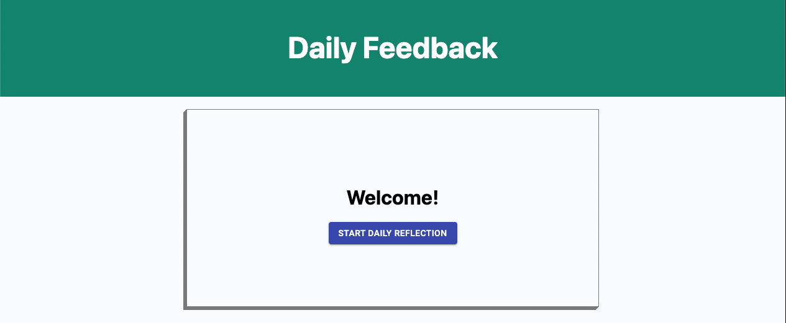
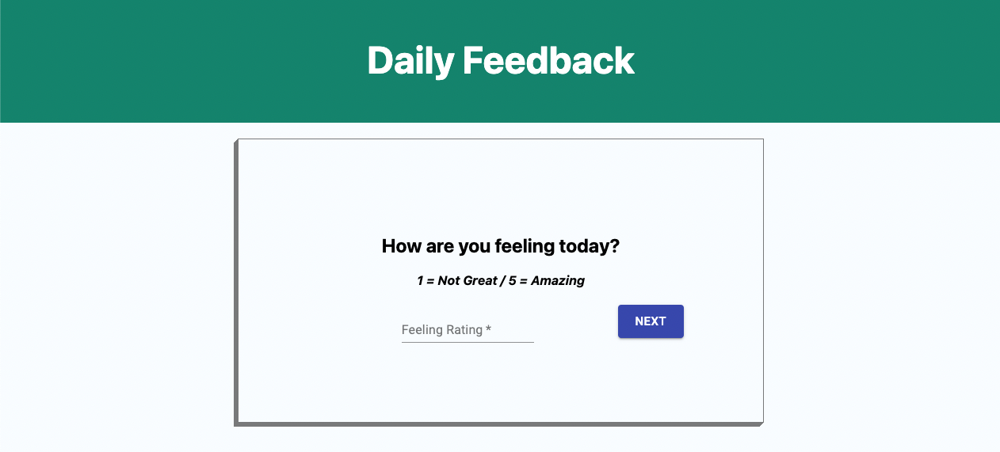
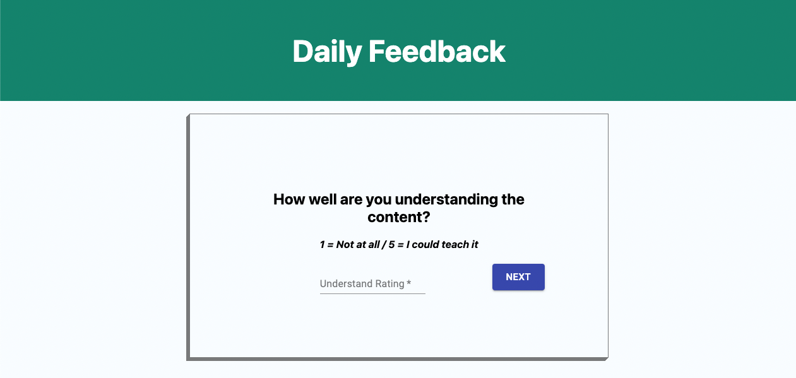
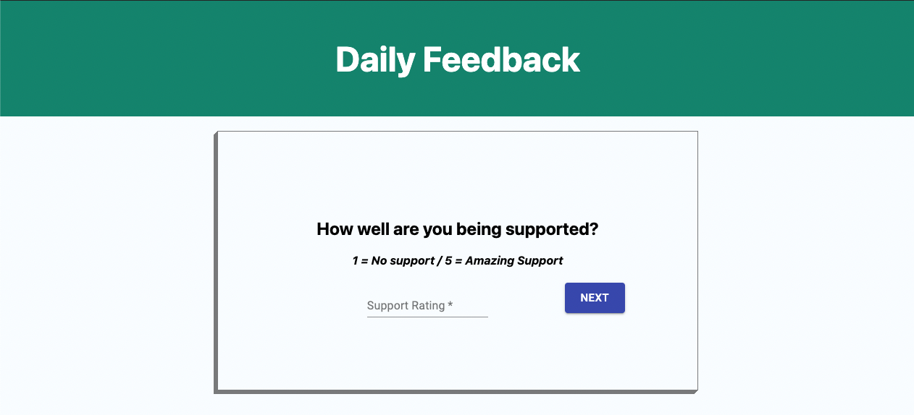
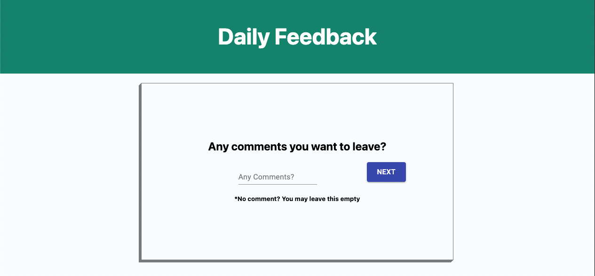
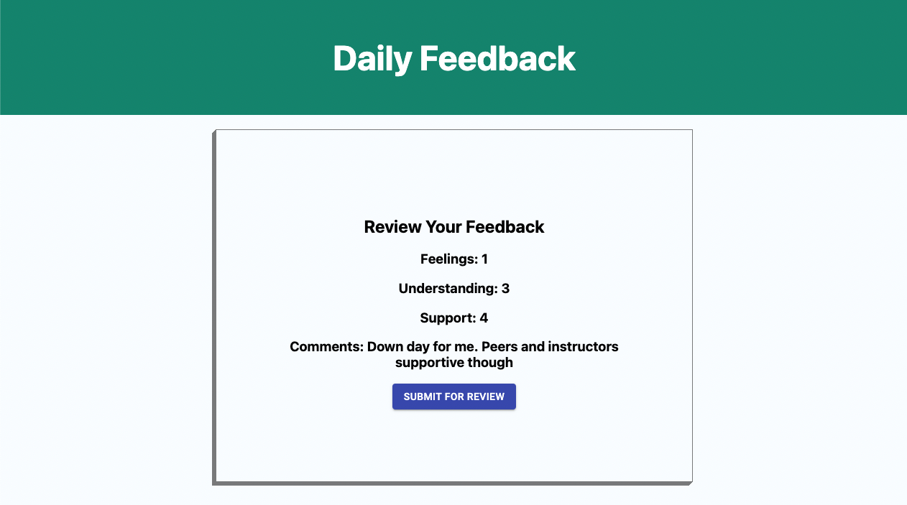
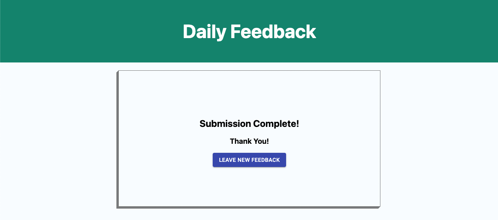
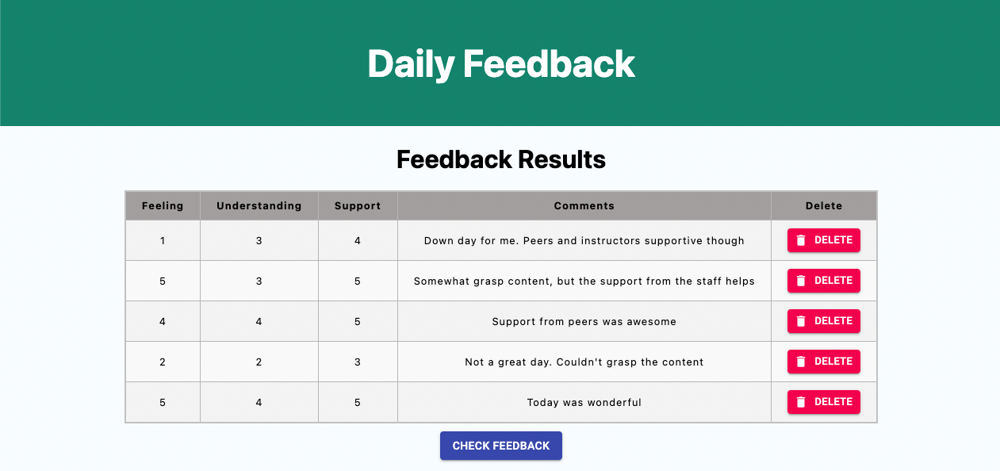

# Redux Feedback Loop

## Description

_Duration: 1 Week_

In this project a user can complete the forms for a daily reflection. A user will start at the home screen and progress through each feedback page via clicking the corresponding buttons. Each page will ask the user to input a rating per question. The rating input fields require validation so the user must submit a number. Once each question is asked, a comment screen will appear allowing the user to input any comments they wish. If the user does not want to add any comments they can proceed. A review page will render and show all the ratings and comments from the previous pages. Upon clicking submit, the data will be sent to a database to be used in the admin page. A thank you screen with a button to allow the user to leave new feedback will appear. The user can complete a new feedback form if they would like.

## Screen Shot

### Prerequisites

- [Node.js](https://nodejs.org/en/)
- [Postico](https://eggerapps.at/postico/)
- PostgreSQL

## Installation

1. Fork and clone project
2. Open with the editor of your choice
3. Create a database through Postico called `prime_feedback`
4. Data to setup table found in `data.sql` file
5. Open terminal and run `brew services start postgresql`
6. Run `npm install` to get dependencies for `package.json`
7. Split terminal window
8. `npm run server`
9. `npm run client`
10. Browser will load and direct to `http://localhost:3000`
11. When finished in each terminal window press `control + C` to stop server and client
12. Stop postgresql in terminal with `brew services stop postgresql`

## Usage

1. On page load, Welcome page appears with a Start Daily Reflection button to click
2. Feeling - Question will appear and takes in a rating. Next button moves user to next screen
3. Understanding - New question will appear and takes in a rating. Next button moves user to next screen
4. Support - New question will appear and takes in a rating. Next button moves user to next screen
5. Comments - Comment input field will appear allowing user to add comments or may be left empty. Next button moves user to next screen
6. User brought to a review page to show all inputs that have been captured. Upon submit for review, the data is sent to the database
7. Submission Complete - Thank you page which also allows user to start a new feedback if they would like to
8. Admin - Admin page can be accessed via `http://localhost:3000/#/admin`
9. In admin the user can view all submitted feedback results.
10. A check feedback button allows user to see if any new feedback has been sent to the database.

## Built With

- React
- Redux
- Node.js
- Express.js
- PostgreSQL
- Javascript
- Material-UI
- HTML
- CSS 

## Acknowledgement

Thanks to Prime Digital Academy who equipped and helped me to make this application a reality.

## Support

If you have suggestions or issues, please email me at terry.okeefe87@gmail.com